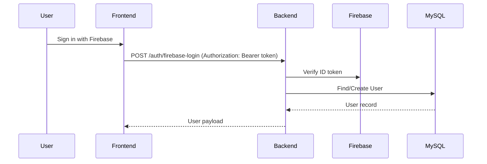

# Authentication Flow

## Summary
Firebase ID tokens authenticate users for REST endpoints and Socket.IO.

## Actors
- User
- Frontend (React)
- Backend REST API (Express)
- Socket.IO server
- Firebase Auth (token verification)
- MySQL (via Prisma `User`)

## Flow (placeholders)

## Wiki Links
- [[Authorization Flow]]
- [[Request Lifecycle]]
- [[System Architecture]]

## TODO
- Document exact frontend auth endpoints usage (login/signup vs firebase-login/signup)
- Document how AuthContext stores tokens/user data (confirmed later)
