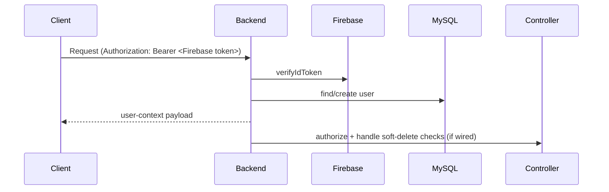

# Authorization Flow

## Summary
Authorization is enforced primarily via **Firebase ID token verification** (REST and Socket.IO). A separate JWT middleware exists but is not confirmed as primary.

## Wiki Links
- [[Authentication Flow]]
- [[Authorization Security]]
- [[Security Checklist]]
- [[System Architecture]]

## REST authorization (placeholders)

## Socket authorization (placeholders)
- Socket.IO middleware verifies Firebase token from `handshake.auth.token` or `handshake.query.token`
- Socket events use per-match rooms
- Rate limiting is applied for chat events

## TODO (to complete in Phase 3)
- Verify which routes use `verifyFirebaseToken`
- Verify whether `authenticateToken` / `requireActiveUser` is actually used in route wiring
