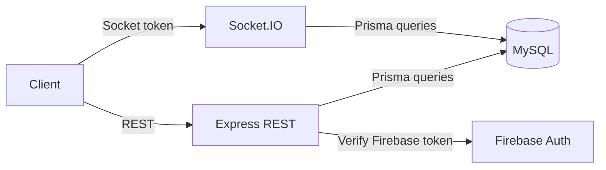

# Backend Architecture

## Summary
Express (TypeScript) REST API + Socket.IO real-time layer + Prisma ORM with MySQL.

## Key modules (placeholders)
- [[server.ts]] (Express app wiring)
- [[socket.ts]] (Socket.IO auth + chat events + online status)
- [[firebaseAuth]] middleware (Firebase ID token → MySQL user upsert)
- [[auth middleware]] (JWT-based auth exists, verify wiring in Phase 3)

## Data flow (placeholders)

## Navigation
- [[System Architecture]]
- [[Request Lifecycle]]
