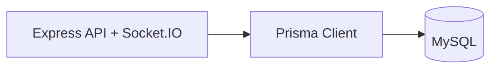

# Database Architecture

## Summary
Prisma ORM over MySQL. Core entities: `User`, `Skill`, `UserSkill`, `MatchRequest`, `Match`, `Message`, `Rating`, `Session`, `Exchange`, `Achievement`, `Notification`, plus gamification/streak tables.

## Diagram placeholder

## Wiki links
- [[Prisma Schema]]
- [[Models]]
- [[Relationships]]
- [[ER Diagram]]

## Navigation
- [[System Architecture]]
- [[Database Overview]]
