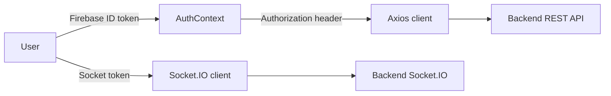

# Frontend Architecture

## Summary
Frontend is a React + TypeScript application with protected routing and Firebase-authenticated API calls, plus Socket.IO chat.

## Key sub-areas
- [[Routing]]
- [[State Management]]
- [[UI Architecture]]
- [[Chat Lifecycle]] (created in Phase 4)
- [[Authentication Flow]]

## Data flow (placeholders)

## Navigation
- [[System Architecture]]
- [[Frontend Overview]]
