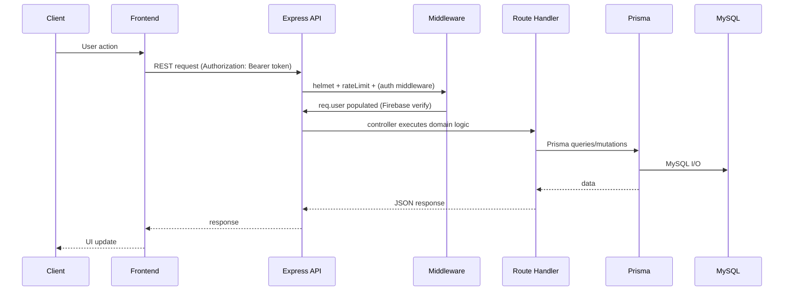

# Request Lifecycle

## Summary
How a typical REST request flows through SkillSwap backend.

## Lifecycle (placeholders)

## Security checks (placeholders)
- Token verification: `verifyFirebaseToken`
- Soft-delete blocking: `requireActiveUser` (exists, wiring needs verification)
- Request validation: `express-validator` where defined

## Wiki Links
- [[Authentication Flow]]
- [[Authorization Flow]]
- [[API Security]]

## TODO
- Document per-route middleware composition based on `routes/*.ts`.
