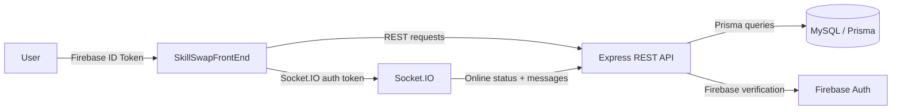

# System Architecture

## Overview
SkillSwap is a **Firebase-authenticated** system with:
- a **REST API** (Express + Prisma + MySQL)
- a **real-time chat layer** (Socket.IO)
- a **React frontend** with protected routing

## High-level diagram

## Components (as discovered)
- **Frontend**
  - Protected pages via `ProtectedRoute`
  - Auth state via `AuthContext`
  - Chat UI via `Messages.tsx` + Zustand store + Socket.IO handlers
- **Backend**
  - `server.ts` wires REST routes and security middleware
  - `socket.ts` authenticates socket connections and broadcasts status
  - `middleware/firebaseAuth.ts` ensures a MySQL `User` exists

## Wiki links
- [[Frontend Architecture]]
- [[Backend Architecture]]
- [[Database Architecture]]
- [[Authentication Flow]]
- [[Authorization Flow]]
- [[Request Lifecycle]]
